<h1 align="center">Hi 👋, I'm Shiv Kumar</h1>

<h3 align="center">
  Java Backend Developer | Spring Boot | REST APIs | MySQL
</h3>

  Dedicated and efficient Java developer passionate about backend development,
  clean code and continuously learning new technologies.

  
  
  
  

---

## 👨‍💻 About Me

- 🔭 Currently working on **Java Backend Projects**
- 🌱 Currently learning and improving my **Spring Boot & Backend Development** skills
- 👯 Looking to collaborate on **Java / Backend Projects**
- 💻 All of my projects are available on my **Portfolio**
- 📚 Continuously expanding my knowledge of modern technologies
- 📫 Reach me at **kshiv.dot@gmail.com**
- 📄 [View My Resume](https://drive.google.com/file/d/1O8ZG7DksA2tV2fFf2s7rAJ1gqzHSNmav/view?usp=sharing)

---

## 🛠️ Languages & Tools

---

## 💻 Backend Development

---

## 🗄️ Database

---

# 📊 GitHub Statistics

  

  

---

# 🐍 Contribution Snake

<picture>

<source
  media="(prefers-color-scheme: dark)"
  srcset="https://raw.githubusercontent.com/Shiv-96/Shiv-96/output/github-contribution-grid-snake-dark.svg"
/>

<source
  media="(prefers-color-scheme: light)"
  srcset="https://raw.githubusercontent.com/Shiv-96/Shiv-96/output/github-contribution-grid-snake.svg"
/>

</picture>

---

# 🚀 What I'm Currently Focusing On

---

# 📂 My Projects

---

# 📄 Resume

---

# 🤝 Connect With Me

&nbsp;

&nbsp;

---

# ⚡ Quick Facts

| Category | Details |
|---|---|
| 👨‍💻 Role | Java Backend Developer |
| ☕ Primary Language | Java |
| 🌱 Currently Learning | Spring Boot & Backend Development |
| 🗄️ Database | MySQL |
| 🔧 Backend | Spring / Spring Boot / REST APIs |
| 🤝 Collaboration | Backend Projects |
| 🌐 Portfolio | [shiv-96.github.io](https://shiv-96.github.io/) |

---

<h3 align="center">
  Thanks for visiting my profile! 🚀
</h3>

  ⭐ Feel free to explore my repositories and projects.

